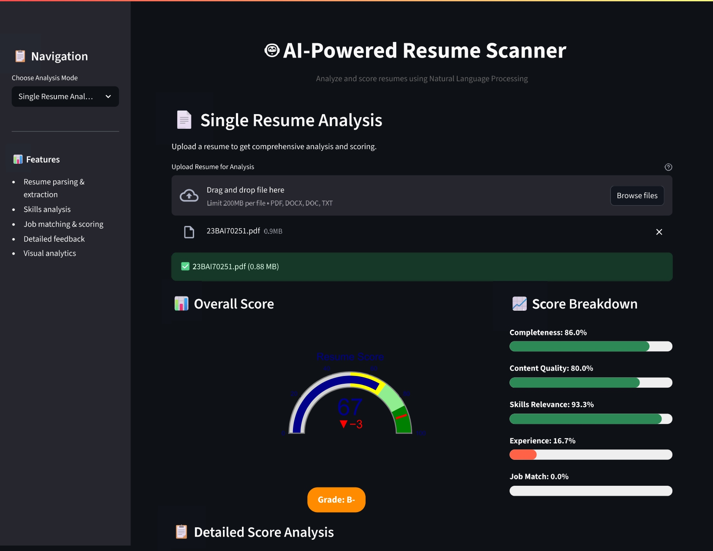
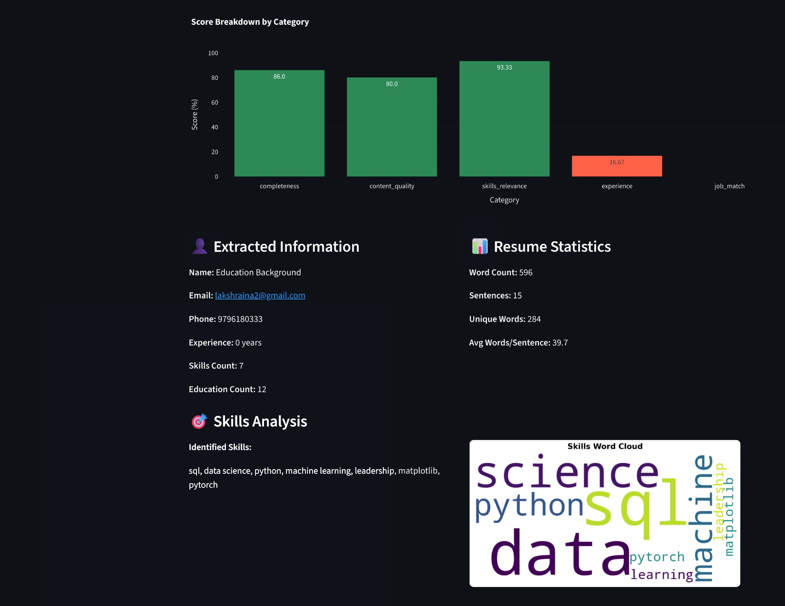
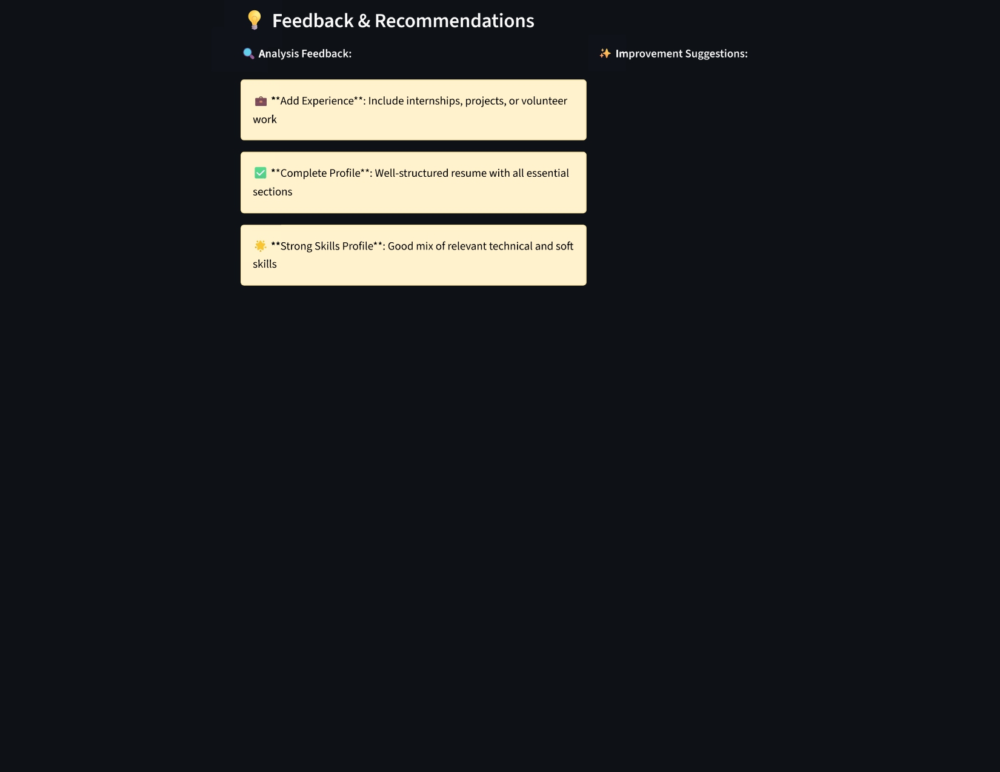

# AI-Powered Resume Scanner

[](https://lakshraina2-ai-resume-scanner-app-pbsmwu.streamlit.app/)

**Check out the live, interactive application hosted on Streamlit Cloud:**

### 👉 [https://lakshraina2-ai-resume-scanner-app-pbsmwu.streamlit.app/](https://lakshraina2-ai-resume-scanner-app-pbsmwu.streamlit.app/)

## 🎯 Overview

The AI-Powered Resume Scanner is a comprehensive web application that uses Natural Language Processing (NLP) and machine learning techniques to analyze resumes, score them against job descriptions, and provide intelligent insights for both job seekers and recruiters.

## ✨ Features

### 📄 Resume Analysis
- **Multi-format Support**: PDF, DOCX, DOC, and TXT files
- **Intelligent Parsing**: Extracts names, contact info, skills, education, and experience
- **Content Quality Assessment**: Analyzes writing quality, structure, and completeness
- **Skills Identification**: Automatically identifies technical and soft skills

### 🎯 Job Matching
- **Similarity Scoring**: Uses TF-IDF and cosine similarity algorithms
- **Multi-method Analysis**: Keyword matching, skills matching, experience matching
- **Skills Gap Analysis**: Identifies missing skills and provides recommendations
- **Batch Processing**: Rank multiple resumes against a single job description

### 📊 Comprehensive Scoring
- **Overall Score**: Weighted combination of multiple factors
- **Category Breakdown**: Scores for completeness, content quality, skills, and experience
- **Letter Grades**: A+ to D grading system
- **Detailed Feedback**: Actionable improvement suggestions

### 📈 Interactive Visualizations
- **Score Gauges**: Interactive gauge charts for overall scores
- **Comparison Charts**: Bar charts, radar charts, and pie charts
- **Word Clouds**: Visual representation of skills and keywords
- **Progress Bars**: Color-coded progress indicators

## 📸 Project Screenshots

Here are visual examples of the AI-Powered Resume Scanner in action, showcasing all major features and interfaces:

### 📄 Resume Analysis Dashboard

*The analysis dashboard provides comprehensive resume scoring with detailed breakdowns, extracted information, skills analysis, and actionable feedback.*

<div align="center">


*Main Analysis Interface with Overall Scoring*


*Detailed Score Breakdown and Extracted Information*


*Skills Analysis and Improvement Recommendations*

</div>

---

### 🎯 Job Matching Interface

*The job matching feature compares resumes against job descriptions, providing similarity scores, skills gap analysis, and targeted improvement recommendations.*

<div align="center">


*Job Matching Interface with Similarity Scoring*


*Skills Gap Analysis and Method Comparison*


*Improvement Recommendations and Detailed Feedback*

</div>

---

### 🌟 Key Visual Features Demonstrated:
- 🔢 **Overall Scoring**: Interactive gauge charts displaying resume scores from 0-100
- 📊 **Category Breakdown**: Color-coded progress bars for different scoring categories
- 🎯 **Skills Analysis**: Word clouds and comprehensive skills comparison charts
- 📈 **Method Comparison**: Radar charts showing different matching algorithms
- 💡 **Smart Recommendations**: Color-coded feedback boxes with actionable insights
- 📋 **Data Extraction**: Organized display of parsed resume information
- 🏆 **Ranking Results**: Batch processing results with downloadable CSV reports
- 🎨 **Interactive UI**: Modern, responsive design with intuitive navigation

> **Note**: All screenshots showcase the actual application interface running with real data, demonstrating the full functionality and user experience.

## 🛠️ Technology Stack

- **Frontend**: Streamlit
- **NLP Libraries**: NLTK, spaCy, scikit-learn
- **Document Processing**: PyPDF2, pdfplumber, python-docx, textract
- **Machine Learning**: TF-IDF Vectorization, Cosine Similarity, Named Entity Recognition
- **Visualizations**: Plotly, Matplotlib, Seaborn
- **Resume Parsing**: pyresparser, custom parsing algorithms

## 🚀 Installation & Setup

### Prerequisites
- Python 3.7 or higher
- pip package manager

### Step 1: Clone the Repository
```bash
git clone https://github.com/yourusername/ai-resume-scanner.git
cd ai-resume-scanner
```

### Step 2: Create Virtual Environment
```bash
python -m venv venv
source venv/bin/activate  # On Windows: venv\Scripts\activate
```

### Step 3: Install Dependencies
```bash
pip install -r requirements.txt
```

### Step 4: Download spaCy Model
```bash
python -m spacy download en_core_web_sm
```

### Step 5: Download NLTK Data
```python
import nltk
nltk.download('punkt')
nltk.download('stopwords')
nltk.download('wordnet')
```

### Step 6: Run the Application
```bash
streamlit run app.py
```

The application will open in your browser at `http://localhost:8501`

## 📁 Project Structure

```
ai_resume_scanner/
├── app.py                          # Main Streamlit application
├── requirements.txt                # Project dependencies
├── config.py                       # Configuration settings
├── README.md                       # Project documentation
├── analysis/                       # Resume analysis screenshots
│   ├── analysis_page-0001.jpg      # Main analysis interface
│   ├── analysis_page-0002.jpg      # Score breakdown
│   └── analysis_page-0003.jpg      # Skills analysis
├── job match/                      # Job matching screenshots
│   ├── job match_page-0001.jpg     # Job matching interface
│   ├── job match_page-0002.jpg     # Skills gap analysis
│   └── job match_page-0003.jpg     # Recommendations
├── models/
│   ├── __init__.py
│   ├── resume_parser.py            # Resume parsing logic
│   ├── job_matcher.py              # Job matching algorithms
│   └── scoring_engine.py           # Resume scoring algorithms
├── utils/
│   ├── __init__.py
│   ├── text_processing.py          # Text preprocessing utilities
│   ├── file_handler.py             # File upload and processing
│   └── visualization.py            # Charts and visualizations
└── data/
    ├── sample_resumes/             # Sample resume files (optional)
    └── job_descriptions/           # Sample job descriptions (optional)
```

## 🎮 Usage

### Single Resume Analysis
1. Select "Single Resume Analysis" from the sidebar
2. Upload a resume file (PDF, DOCX, DOC, or TXT)
3. View comprehensive analysis including:
   - Overall score and grade
   - Category-wise breakdown
   - Extracted information
   - Skills analysis
   - Improvement recommendations

### Resume vs Job Description
1. Select "Resume vs Job Description" from the sidebar
2. Upload a resume file
3. Paste the job description
4. View matching analysis including:
   - Job match score
   - Skills gap analysis
   - Method-wise comparison
   - Improvement recommendations

### Batch Resume Ranking
1. Select "Batch Resume Ranking" from the sidebar
2. Paste the job description
3. Upload multiple resume files (up to 10)
4. View ranked results with scores
5. Download results as CSV

## 🔧 Configuration

Edit `config.py` to customize:
- File size limits
- Scoring thresholds
- Skills databases
- Visualization settings
- Application settings

## 📊 Scoring Algorithm

The scoring system uses a weighted combination of multiple factors:

- **Completeness (30%)**: Resume sections and required information
- **Content Quality (25%)**: Text quality, structure, and readability
- **Skills Relevance (20%)**: Technical and soft skills assessment
- **Experience (15%)**: Years of experience and career progression
- **Job Match (10%)**: Similarity to job description (when provided)

## 🎯 Use Cases

### For Job Seekers
- **Resume Optimization**: Get objective feedback on resume quality
- **Job Matching**: See how well your resume matches specific jobs
- **Skill Gap Analysis**: Identify missing skills for target positions
- **Improvement Guidance**: Receive actionable recommendations

### For HR Professionals
- **Candidate Screening**: Quickly assess and rank candidates
- **Objective Evaluation**: Reduce bias in initial screening
- **Skill Assessment**: Identify candidates with required skills
- **Batch Processing**: Handle multiple applications efficiently

### For Recruiters
- **Talent Matching**: Match candidates to job requirements
- **Quality Assessment**: Evaluate resume quality and completeness
- **Candidate Comparison**: Compare multiple candidates objectively
- **Efficiency**: Automate initial screening process

## 🔒 Privacy & Security

- **No Data Storage**: Files are processed in memory only
- **Temporary Processing**: Temporary files are automatically cleaned
- **No Retention**: No personal information is stored permanently
- **Local Processing**: All processing happens locally on your machine

## 🧪 Testing

### Sample Data
Use the sample resumes and job descriptions in the `data/` folder to test the application.

### Test Cases
1. Upload different file formats (PDF, DOCX, TXT)
2. Test with resumes of varying quality and completeness
3. Compare resumes against different job descriptions
4. Test batch processing with multiple files

## 🚀 Deployment

### Local Deployment
The application runs locally using Streamlit's development server.

### Cloud Deployment
For production deployment, consider:
- **Streamlit Cloud**: Easy deployment with GitHub integration
- **Heroku**: Container-based deployment
- **AWS/GCP/Azure**: Cloud platform deployment
- **Docker**: Containerized deployment

### Docker Deployment
```bash
# Build Docker image
docker build -t ai-resume-scanner .

# Run container
docker run -p 8501:8501 ai-resume-scanner
```

## 🤝 Contributing

1. Fork the repository
2. Create a feature branch (`git checkout -b feature/amazing-feature`)
3. Commit your changes (`git commit -m 'Add amazing feature'`)
4. Push to the branch (`git push origin feature/amazing-feature`)
5. Open a Pull Request

## 📝 License

This project is licensed under the MIT License - see the [LICENSE](LICENSE) file for details.

## 🙏 Acknowledgments

- **spaCy**: Advanced NLP library
- **NLTK**: Natural Language Toolkit
- **Streamlit**: Web application framework
- **scikit-learn**: Machine learning library
- **Plotly**: Interactive visualizations
- **pyresparser**: Resume parsing library


## 📈 Future Enhancements

- **AI Model Integration**: GPT-based parsing and analysis
- **Database Support**: Store analysis history
- **API Endpoints**: RESTful API for integration
- **Mobile App**: React Native mobile application
- **Advanced Analytics**: Machine learning insights
- **Multi-language Support**: Support for multiple languages
- **ATS Integration**: Connect with Applicant Tracking Systems

---

**Version**: 1.0.0  
**Maintainer**: Lakshay Raina
